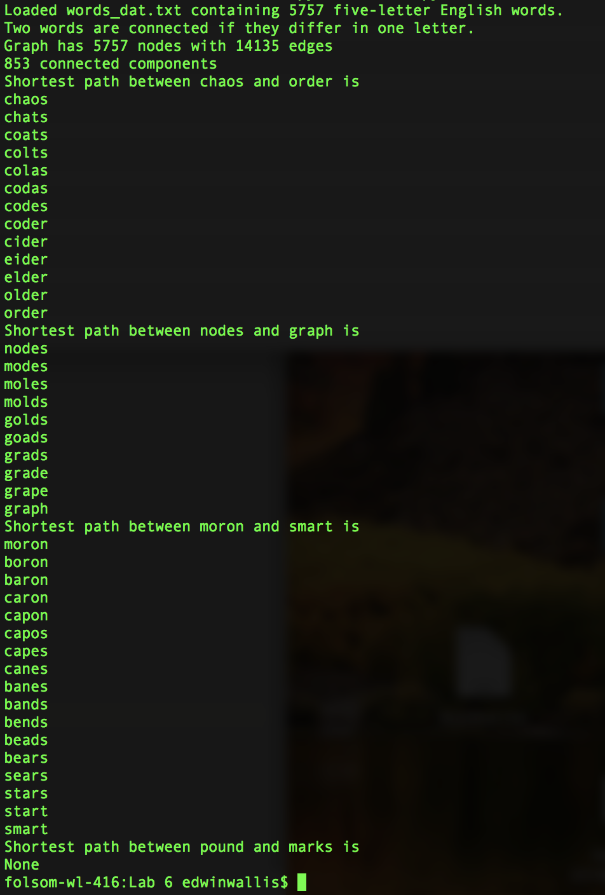
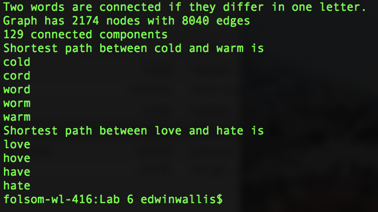
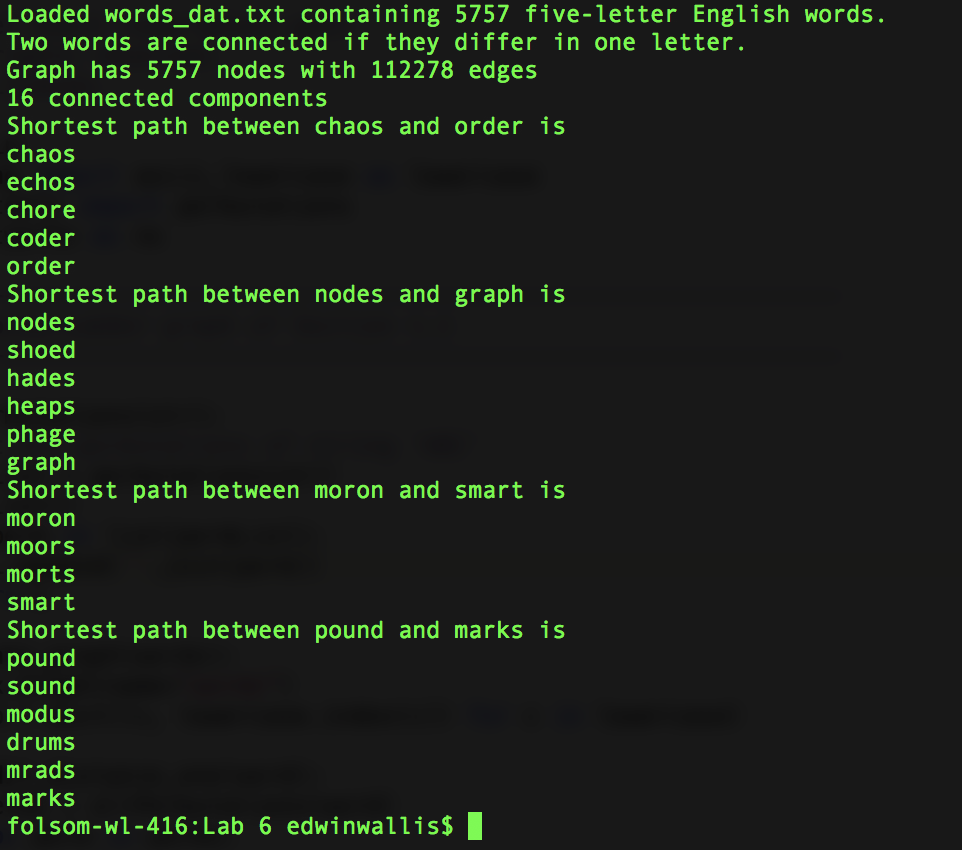

# Lab 6
Downloaded the networkx via pip  
Looked at examples of graphs  
Downloaded the Knuths program modifying it now   
### Results for the 4 five letter pairs
  
The code for this is in 5words.py
### Results for the 2 four letter pairs

The code for this is in 4words.py
### Results for the 4 five letter pairs using the unordered function implementation

The code for this is in 5wordsNoOrder.py
