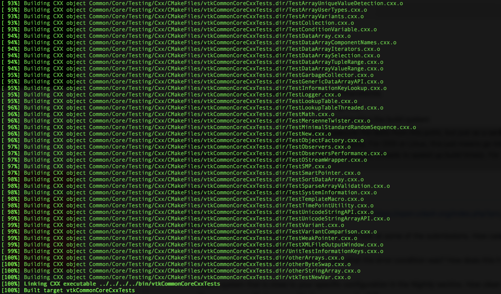

# Lab 8
Checkpoint 1 

Checkpoint 2

Checkpoint 4
Not sure what happened but 7 tests failed however I passed the TestNewArrayInterpolationDense.cxx test the test was wrong. On line 77 the GetValue(0, 1) == was equal to 4 and not 2

