# Lab 11
## Checkpoint 1
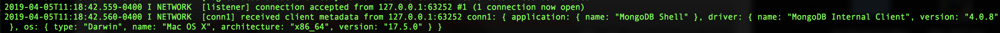
## Checkpoint 2
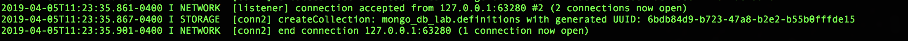
## Checkpoint 3
### find()
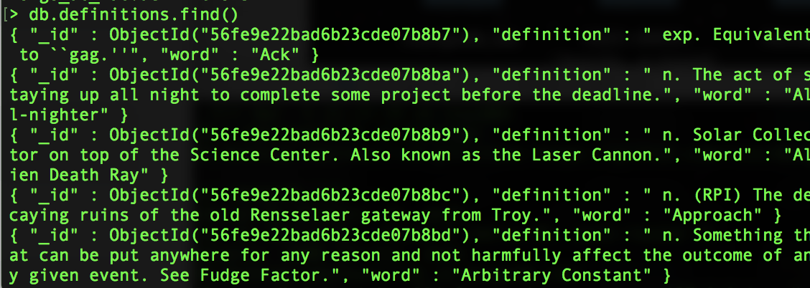
### findOne()
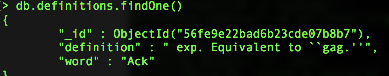
### find(captialand)
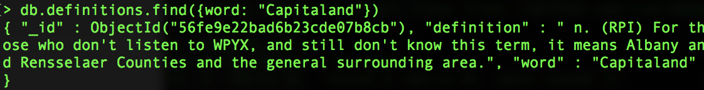
### find object id
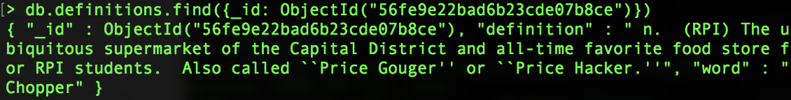
### insert
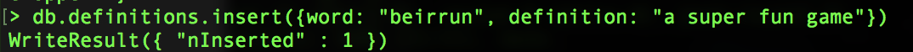
### find the insert
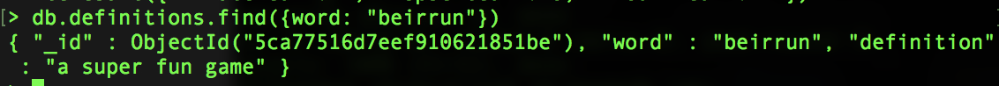
### update the insert
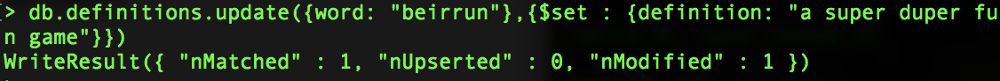
### find the updated insert
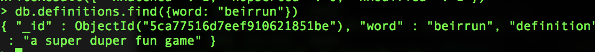
### find git changes
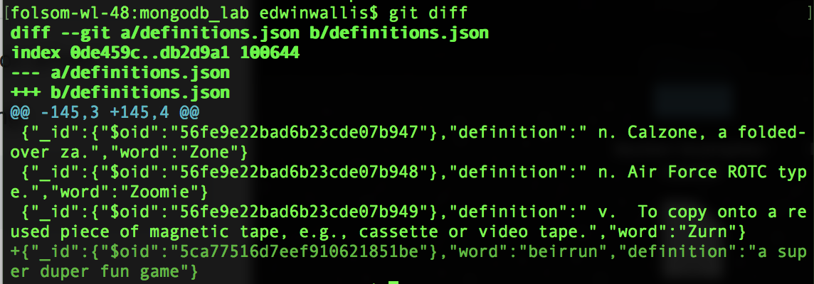
## Checkpoint 4
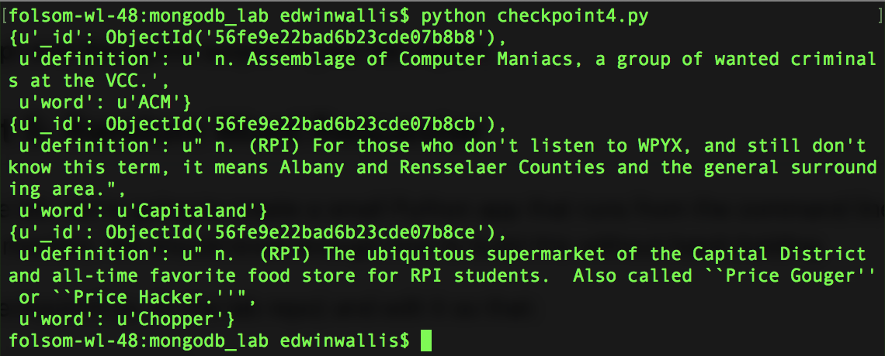
## Checkpoint 5
### Ran it a bunch of times but I had to change the $push to $set so it updated it but did not add another item
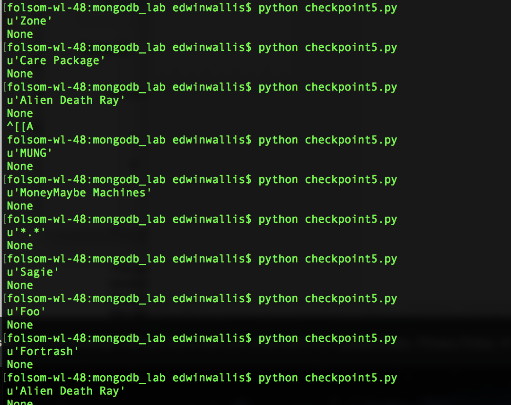
### the first time
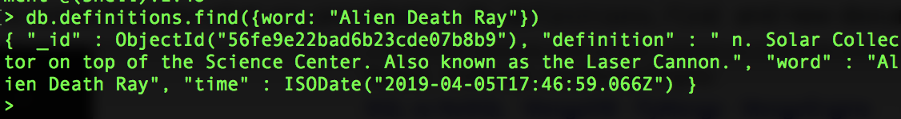
### the second time
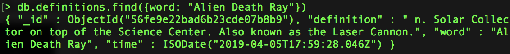